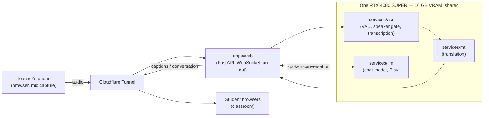

# Architecture

## End-to-end path

1. **Phone (teacher)** — a browser tab on the teacher's phone captures audio
   from a paired lavalier microphone and streams it to the server. A Screen
   Wake Lock keeps the tab alive while the phone screen would otherwise sleep
   ([ADR 0004](decisions/0004-phone-as-microphone.md)).
2. **Cloudflare Tunnel** — the only path in from the internet to the home
   network. No ports are forwarded on the router
   ([ADR 0003](decisions/0003-cloudflare-tunnel.md)).
3. **Server (WSL2, on the teacher's desktop)** — hosts every service below,
   sharing one GPU ([ADR 0002](decisions/0002-run-everything-in-wsl2.md)).
4. **Services** — process the audio and produce captions (Eco) or carry on
   a spoken conversation (Play); see below.
5. **Student browsers** — in the classroom, on whatever machines are
   available (shared or per-student — see `open-questions.md`). Receive
   captions or converse via the web app over the same tunnel.

## Components and responsibilities

- **`apps/web`** — the FastAPI app. Serves pages, manages lesson sessions,
  fans out caption updates to connected student browsers over WebSocket.
  Placeholder only at this stage — see `apps/web/README.md`.
- **`services/asr`** — voice activity detection and a speaker gate so only
  the teacher's voice is transcribed, followed by transcription. Whole
  segments are transcribed on a voice-activity pause rather than streamed
  ([ADR 0005](decisions/0005-segment-level-transcription.md)).
- **`services/mt`** — translation, run as a model dedicated to this purpose
  rather than shared with Play's chat model
  ([ADR 0006](decisions/0006-dedicated-translation-model.md)).
- **`services/llm`** — the conversational model behind Play. Not needed
  until later in the course — see `roadmap.md`.
- **`services/encoder`** — placeholder for later; whether it is served at
  all is an open question (see `open-questions.md`).
- **`packages/contracts`** — the data shapes passed between services (e.g.
  a transcribed segment, a translated caption), shared so services agree on
  shape without importing each other's internals.

## The VRAM budget

Every model shares one RTX 4080 SUPER (16 GB VRAM). This is the single
tightest resource in the system and drives sequencing: Eco's models
(voice activity detection, transcription, translation) are comparatively
small and needed from lesson 1. Play's chat model is not needed until later
in the term, and the encoder later still — see `roadmap.md` for why that
order is what makes the budget workable at all. Concrete sizing (which
model, what quantisation) is not yet decided — see `open-questions.md`.

## Topology

